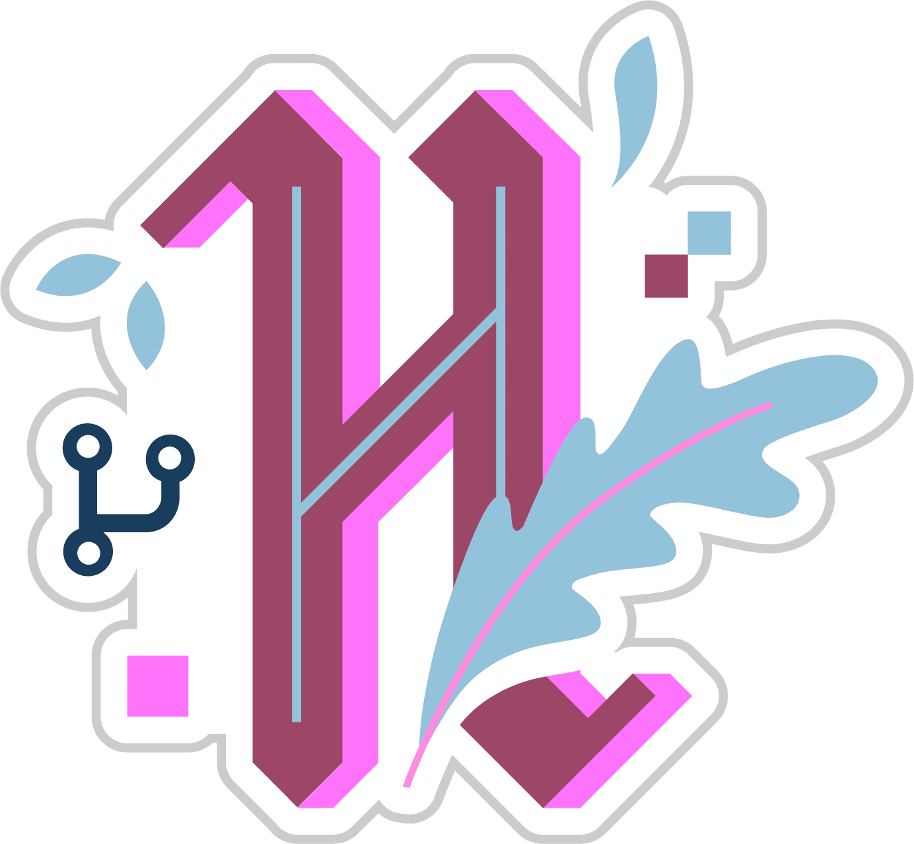

# Hello, 

<h3 align="center">Love to work in a team love to collaborate and work on new stuff</h3>

<h2 align="center">Hands on experience</h2>

  
  
  
  
  
  
  
  
  
  
  
  
  
  
  
  
  
  
  
  
  
  
  
  
  
  
  
  
  
  
  
  

#### Bio:-
* Android App Developer
* React js front end developer
* IOT
* Still a Learner & always be a learner

  <b>Hai.. Great</b> to see you. My self <b>Sukarna Jana</b> standing here and wating with lots of Dreams to convert into reality.

*  Parents,Nature,Computer are my world 
*  My GF :- Nature & and their Natural Beauty 
*  Live in present capture capture the past 
*  Dream to travel wherever I point fast 
*  Ha nature i Love u vast... 

## Badges

<h1 align="center">You can find me on :-</h1>

  
  
  
  
  
  
  

<h1 align="left">I have worked with the Languages are :-</h1>

  

  

  I Have a knowledge of  <b>Python, Kotlin, C++/C, JavaScript,Java..</b> (Still Exploring New language)

<h1 align="left">My Stats :-</h1>

## Fun Fact about me:- ##
* If you motivate me i can work in my high potential non stop till the work completes.
* If you can't motivate me then i will sleep. (i sleep a lot)

